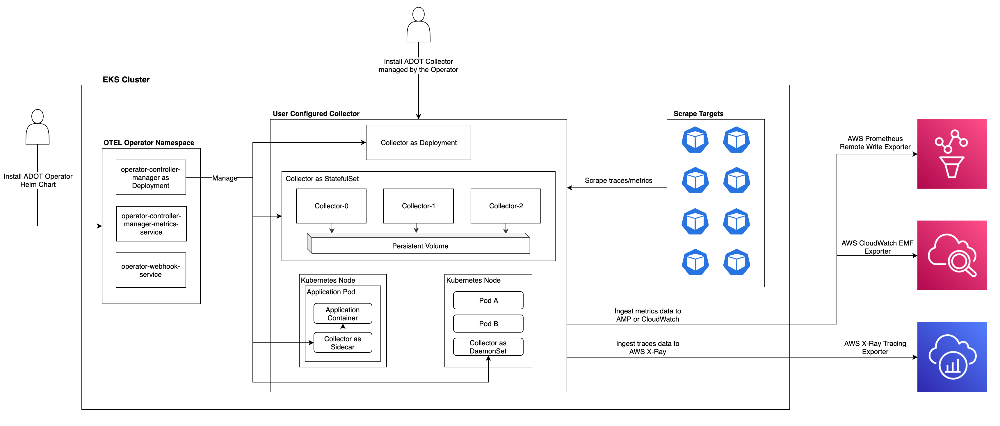
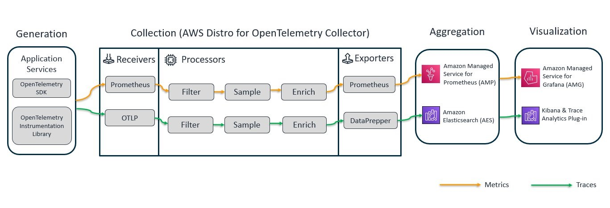
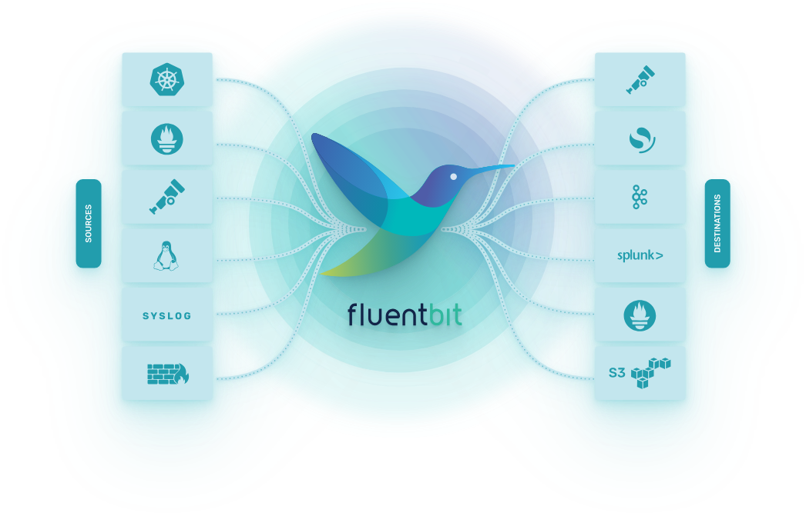
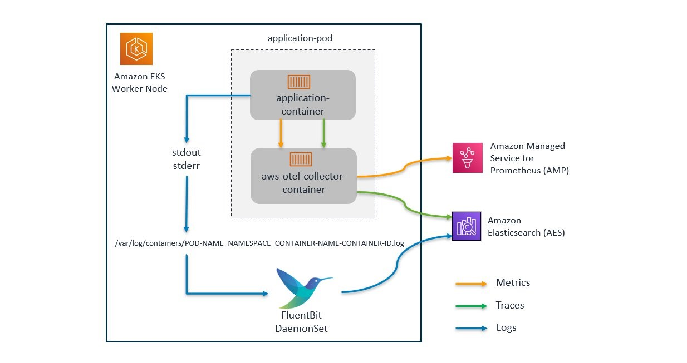

# OpenTelemetry

OpenTelemetry works on different levels to provide a vendor-agnostic experience. It offers open-standard semantics so you can write vendor-agnostic code.

We can deploy the vendor-neutral collector binary in various ways.

It supports multiple open source and commercial protocols (see https://github.com/open-telemetry/opentelemetry-collector-contrib/tree/main/receiver) to export to a vendor-specific backend. It provides a vendor-agnostic library for these languages:

.NET
C++
Erlang/Elixir
Go
Java
Javascript
PHP
Python
Ruby
Rust
Swift

So, in a typical OpenTelemetry-based observability deployment, you have an application using the OpenTelemetry SDK to manually or automatically instrument the application code. The collected metric is sent using an agnostic protocol to the OpenTelemetry Collector. The OpenTelemetry Collector receives, processes, and exports the telemetry data to the backend. The OpenTelemetry Collector implements modular architectures, where receivers, processors, and exporters can be organized into pipelines to export the collected telemetry to one or more backends.

Link - https://opentelemetry.io/

## AWS Distro for OpenTelemetry

Vendors invest time to ensure end users can use OpenTelemetry effortlessly on their platforms. AWS provides the AWS Distro for OpenTelemetry (see https://aws.amazon.com/otel/), a secure, tested, production-ready OpenTelemetry distribution. AWS Distro for OpenTelemetry will automatically collect metadata from the AWS environment where your code is running. It supports AWS Lambda, Amazon EC2, Amazon ECS, and Amazon Elastic Kubernetes Services (EKS), the last two regardless of whether you use EC2 or AWS Fargate as the compute runtime for your worker nodes. AWS Distro for OpenTelemetry can export telemetry for all the usual suspects, such as AWS X-Ray, Amazon CloudWatch, Amazon Managed Service for Prometheus, and a list of third-party monitoring solutions as follows:

AppDynamics
Datadog
Dynatrace
Grafana
Honeycomb
Lightstep
Logz.io
New Relic
Splunk
Sumo Logic

Link - https://aws-otel.github.io/docs/introduction

New Relic setup - https://aws-otel.github.io/docs/components/otlp-exporter#new-relic

Elastic/OpenSearch setup (requires dataprepper) - https://aws-otel.github.io/docs/components/otlp-exporter#opensearch

### EKS installation



### RPM package

```bash
# Install collector
git clone https://github.com/aws-observability/aws-otel-collector.git
make package-rpm
sudo rpm -Uvh ./aws-otel-collector.rpm

# Start collector
sudo /opt/aws/aws-otel-collector/bin/aws-otel-collector-ctl -c </path/config.yaml> -a start
```

### EC2 Microsoft Server Installation

```bash
# Install collector
git clone https://github.com/aws-observability/aws-otel-collector.git
.\tools\packaging\windows\create_msi.ps1
msiexec /i aws-otel-collector.msi
or can be installed by double clicking the windows msi file.

# Start collector
& '.\Program Files\Amazon\AwsOpentelemetryCollector\aws-otel-collector-ctl.ps1' -a start
```


https://openmetrics.io/

# Prometheus

Prometheus itself is monitoring software. It runs as a long-running service that scrapes endpoints (which you configure as scrape targets) and stores the metrics in a time-series database. Those endpoints are expected to provide metrics in the format you have mentioned, which has become known as 'OpenMetrics' format. The OpenMetrics format started as just a Prometheus thing, but it's become popular enough that many other monitoring tools will happily also scrape or 'understand' OpenMetrics formatted metrics.

Prometheus can run on pretty much anything, because it's a Go program it just runs as a single binary. That means you can run Prometheus as a Windows executable, a Linux container, or on Kubernetes as pods if you want, among others. But it's part of the CNCF ecosystem, so it's commonly associated with Kubernetes and it is very Kubernetes-friendly. You can easily deploy Prometheus to run on K8s, and it also has automatic service discovery that allows it to easily discover and monitor K8s workloads for you. But it doesn't need to run on K8s or monitor it, it's just well suited to that.

Prometheus can also run in what's called 'agent mode', which is where it doesn't actually store any metrics, but is used exclusively to scrape then forward metrics (using remote_write) to something like New Relic. So it acts as an 'agent' rather than the traditional heavyweight server mode where it stores data.

For high-availability, use Grafana Mimir - https://grafana.com/oss/mimir/



# Fluentbit

Fluent Bit is like a little helper that sits on your servers or devices and watches over your logs, metrics, and other data streams. It's super lightweight, so it doesn't hog resources, and it knows how to quickly gather and process data without slowing anything down.



Imagine you have a bunch of logs coming in from different apps, services, or containers. Fluent Bit can grab those logs, clean them up if needed (like removing sensitive info or adding tags), and then send them to wherever you need—like a monitoring system, a database, or even a cloud service. It's like a middleman that makes sure your data gets from point A to point B smoothly.

For observability, this is key. Fluent Bit helps you keep an eye on everything by collecting logs and metrics in real-time. You can use it to ship data to observability platforms like Elasticsearch, Prometheus, or cloud-based systems like AWS CloudWatch. This means you can see what’s happening across your systems, troubleshoot issues faster, and ensure everything is running smoothly. Essentially, Fluent Bit helps you stay informed about the health and performance of your infrastructure by making sure all your data is where it needs to be for analysis and alerting.

Link - https://fluentbit.io/

## Deployment example for both Prometheus and Elastic/OpenSearch



# Vector

There is also another alternative by Datadog to Fluentbit/logtsash/fluentd - https://vector.dev/

A little young project but I like it, easy to configure, HA out of box, well architected solution. Definetly something to keep eye on in the future.


# ELK (Elastic, Logstash, Kibana)

The Elastic Stack, also known as the ELK Stack, is like a toolkit that helps you manage and understand all the data flowing through your systems. It’s made up of a few key tools that work together to collect, search, and visualize data, making it easier to monitor what's going on in your applications, servers, and network.

- Elasticsearch is the heart of the stack. It’s search engine that stores your data and lets you find whatever you need quickly, whether it's logs, metrics, or other types of data.

- Logstash is like the data wrangler. It takes in raw data from various sources, processes it, and then sends it to Elasticsearch. Think of it as the tool that prepares your data so it’s clean and ready to be analyzed.

- Kibana is the visual side of things. Once your data is in Elasticsearch, Kibana helps you create dashboards and graphs to make sense of it all. It’s the tool you use to see patterns, trends, and get insights from your data.

- Beats are little data collectors that you install on your systems to gather specific types of data (like logs or metrics) and send it to Logstash or Elasticsearch.

## Metricbeat

Metricbeat is a lightweight shipper that you can install on your servers to periodically collect metrics from the operating system and from services running on the server. Metricbeat takes the metrics and statistics that it collects and ships them to the output that you specify, such as Elasticsearch or Logstash.

## Why not use it for metrics?

Elasticsearch wasn’t originally designed for metrics. It was built primarily as a search and analytics engine, particularly strong with log data and text-based searches. However, over time, it has evolved and added features that make it capable of handling time-series data, like metrics, more effectively.

Elasticsearch wasn’t built specifically for time-series data, so it might not store metrics as efficiently as specialized time-series databases like Prometheus, InfluxDB, or others designed for that purpose.

As metrics data grows, especially with high-cardinality data, Elasticsearch might become more challenging to manage and scale effectively compared to purpose-built time-series databases.

